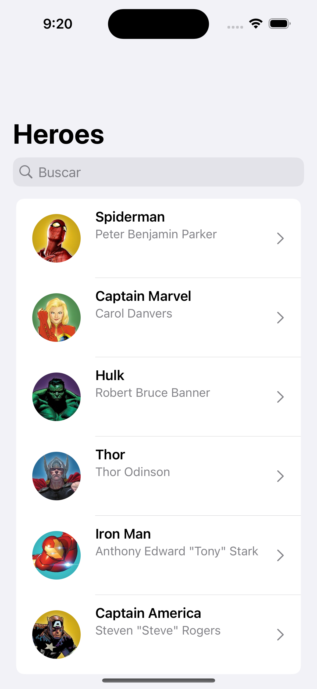
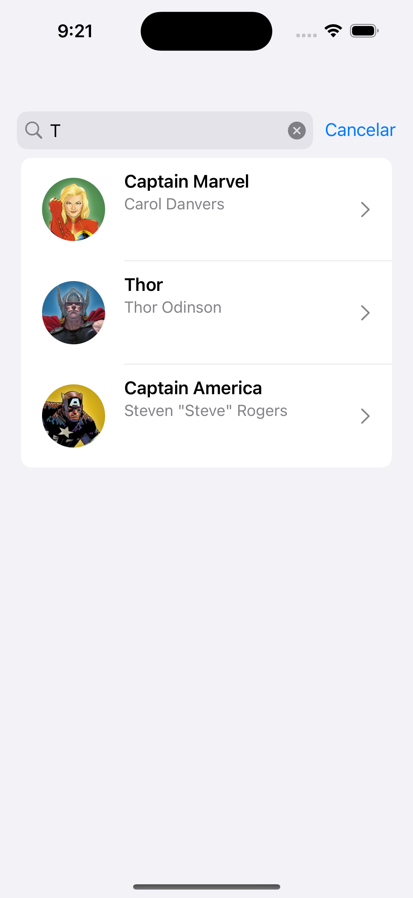
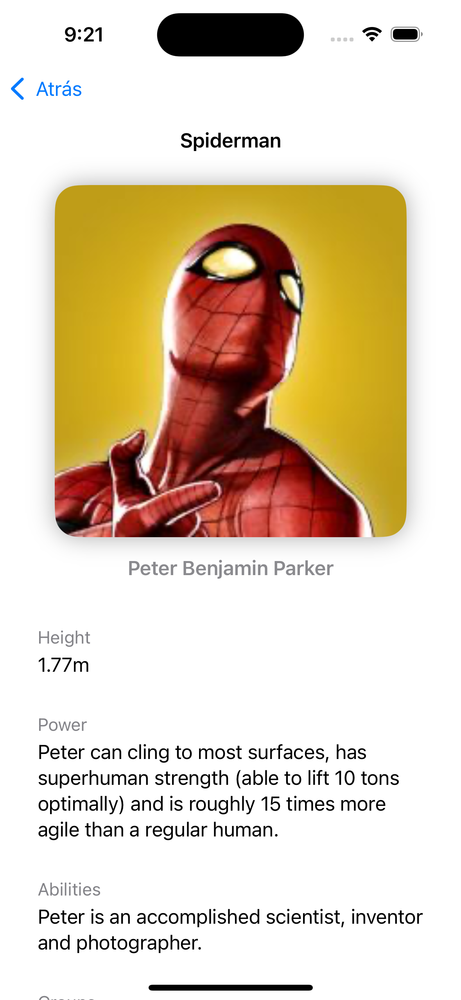

## Project & Architecture

This project was developed as part of my personal portfolio to showcase my coding style, architecture decisions, and best practices using Swift, SwiftUI, and Combine. It demonstrates my proficiency in building scalable and testable iOS applications.

**What's the app about?**

The app fetches a list of superheroes and presents them in a master-detail pattern. Users can search through the list and view detailed information about each hero.

## App Overview

| Main View  | Search  | Details  |
|------------|---------|----------|
|   |    |  |

## Features included

### Git

I adhere to Gitflow for version control, ensuring a clean and manageable release process:

* Main branch + Tags (production releases)
* Develop branch (current working state)
* Feature branches for each feature or improvement
* Hotfixes for urgent production issues, isolated from ongoing development.

Using .gitignore for Swift & Xcode

### Code Style
The project includes a `App > Code > Project > .swiftlint.yml` configuration file to enforce consistent coding standards. Additionally, I've included a Python script to automate code formatting `App > SyntaxScripts > ./styleMe.py` ensuring a unified style across the project.

### Architecture
This project demonstrates multiple architectural patterns to reflect my adaptability and understanding of different paradigms.

#### Clean architecture

This structure clearly separates concerns, ensuring code is modular, testable, and scalable.

#### MVVM + Navigator + Configurator

- Configurator: Holds explicit dependencies
- View: UI/UX
- ViewModel: Business logic and state handling
- Model: State definition
- Navigator: Instantiates the whole module + Navigation in/out

All using SwiftUI & Combine

#### Redux

This app employs a Redux-like pattern for managing state in a predictable way:

- Store: Holds the state and receives actions
- State: Only mutable by actions
- Actions: Triggers for state change
- Reducer: Pure & testeable functions for business logic and calculating the next state given a current state and an action

#### I have also worked with

* VIPER
* Model View ViewModel + RxSwift + UIKit

### Reactive programming (Combine)
Using Apple's native solution `Combine` for operations and SwiftUI for composing, filtering, transforming, and many functional operation while keeping everything synced and reactive in an event based environment

### Log system
I've implemented a custom wrapper around OSLog, allowing logging with different log levels. This helps debugging and production monitoring without polluting the release logs.

### Targets
All is split into a clean architecture with frameworks for:
* Project (Views, UIClasses, etc.)
* Domain (Models, classes, use cases and providers)
* Platform which should be specific implementations against different services (API, Database, Preferences, etc.)

### Dependencies / 3rd Party Frameworks
- Dependencies are kept to the minimum
- Always using Swift Package Manager
- Although I've managed projects with CocoaPods and Carthage.

### Code Autogeneration
Using Sourcery, I automate repetitive tasks such as generating:

- Hashable methods
- Equality checks
- Utility functions for enums

This reduces boilerplate and ensures consistency across the codebase.

## Improvements

This project is a sample app and not intended for being production-ready. However, potential improvements could include:

 
### Architecture
 
- Create independent targets for:
    
	- DataSource ~> API
	- DataSource ~> Static/Mock
        
- Define a class/framework for dealing with data requests in a common way
   
	- Create UI components to be reused (Primary Button, Secondary Button, color scheme, ...)
   
   - Include a Changelog for releases
   
   - Make structures conform to Identifiable
   
   - Use a Log system rather that Swift.print to avoid printing in release environments
   
   - If using assets, use a compile-safe tool like R.swift
   
   - Caché images for decreasing the loading time
 
### Code

- Use async/await

- Define specific errors if needed to:

   - Display better information to the user
   - Easier debugging
   
- Use more complex data set, with different types, not just strings
   
- Refactor repeated/boilerplate bits of code to make it cleaner
 
### UI/UX

- Although the scene/module architecture is well-defined
- Create a Navigation pattern and mechanism
- Deeplinks
- Notifications
- Translations
- Localization (distances, weight, currencies, ...)
- Etc.
    
### Analytics & Tracking
- The project already includes swiftlint
- Gather metrics to analyze how users interact with the app
- Include A/B testing
- Feature flag
- Dynamic configuration, on-the-fly for a fast response if a service or a feature suddenly gets interrupted or fails
 
### Continuous Integration

- Certificates & provisioning profiles creation (See Fastlane)
- Run tests before the release
- Notify (Slack, Jira, ...)
- Automatic upload to Testflight or AdHoc distribution
- Include other tests, specially, UI automations for core flows and functionality that run periodically and before every release
* Use the latest stable status from development into a nightly build.
* Release to the store with one click or with every merge into master.  

### Fastlane
* Automate Certificate generation / sharing
* Automate Provisioning profile generation / sharing
* Automate screenshots in different languages
* Automate metadata upload to the App Store
* Automate Binary distribution [AdHoc, Enterprise, Testflight, AppStore]

### Crash system
* Integrate a crash system (Firebase + Crashlytics)

### Push notifications
* Include mock notifications
* Include real notifications

### Unit Testing
* TDD
* Helps writing pure methods / specification

### About me

Feel free to fork this project, contribute, or simply explore the code. If you'd like to discuss it or have any questions, you can reach me at:

[LinkedIn] - My LinkedIn profile

[Email] - Send me an email

I'd appreciate a mention or even a virtual beer if you find my code helpful!

License
----

MIT

## License
Created by Sento Crespo Penadés - sentoCrespo@gmail.com
Copyright (c) 2024 Sento Crespo  All rights reserved.
All images and content are copyrighted to Marvel Entertainment

[LinkedIn]:https://www.linkedin.com/in/sentoCrespo
[Email]:mailto:sentoCrespo@gmail.com
