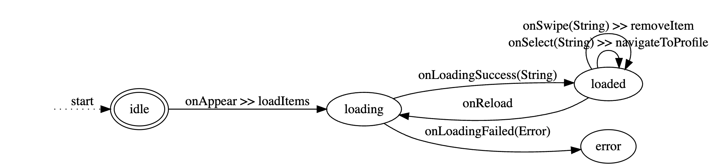

## State Machine Scene

### Definition

The architecture is defined in a way that it's a state machine.

1) Define a .gv file using the visual tool here:
[Graphviz](https://dreampuf.github.io/GraphvizOnline/)

2) Run the project in the workspace named: 
```
State Machine Code Generation
```

It will look for .gv files and create the model file in a  
`{SCENE}Model_Generated.swift` file containing the:
- States
- Initial State
- Events (An action happened)
- Effects (Instructions to trigger logic)
- Transitions (Move from one state to another)

### Example

```
digraph {
    graph [rankdir=LR]

    // States
    0 [label="", shape=plaintext]
    1 [label="idle", peripheries=2]
    2 [label="loading"]
    3 [label="loaded"]
    4 [label="error"]
    
    // Transitions
    0 -> 1 [label="start"] [style=dotted]
    1 -> 2 [label="onAppear >> loadItems"]
    2 -> 4 [label="onLoadingFailed(Error)"]
    2 -> 3 [label="onLoadingSuccess(String)"]
    3 -> 2 [label="onReload"]
    3 -> 3 [label="onSelect(String) >> navigateToProfile"]
    3 -> 3 [label="onSwipe(String) >> removeItem"]
    
}
```

Will look like this:


